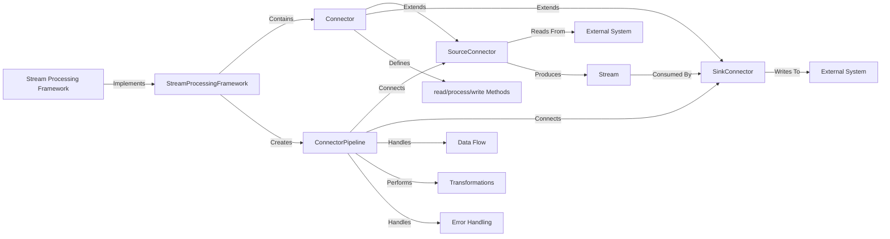
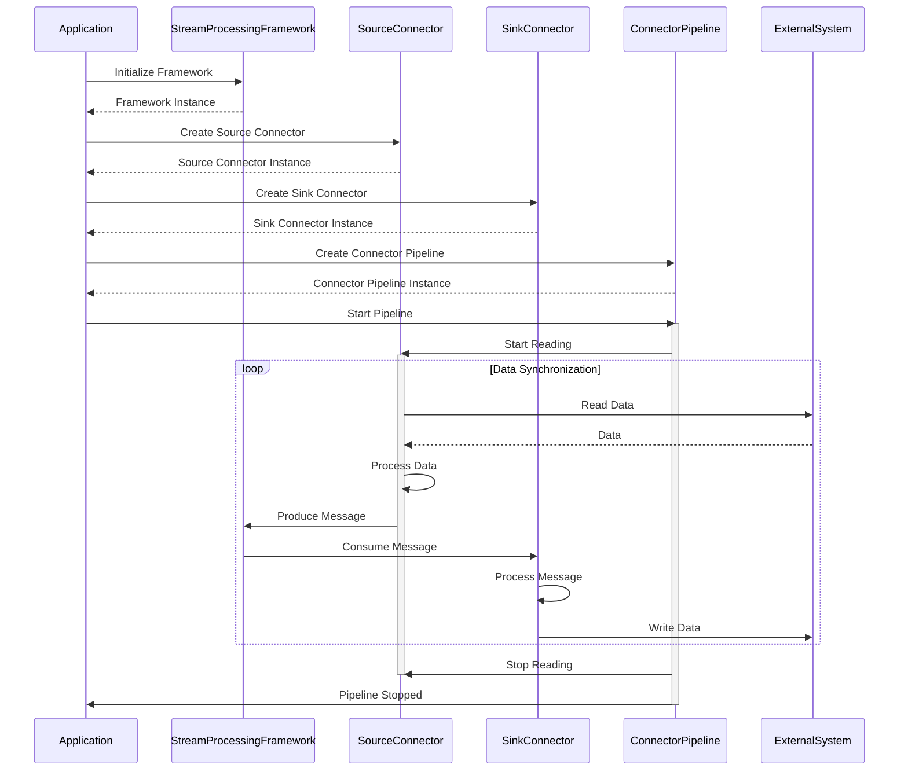

# DataWeaver

## Overview

**DataWeaver** is a powerful and flexible library designed to simplify the process of building data synchronization pipelines between various systems using any stream processing library. The framework provides a set of abstractions and utilities that enable developers to easily create and manage connectors for different data sources and sinks, making it effortless to integrate with external systems.

## Key Features

- Support for multiple stream processing libraries
- Built-in connectors for popular data sources and sinks
- Flexible data transformation and processing
- Fault tolerance and error handling mechanisms
- Extensibility for custom connectors and pipelines
- Easy integration and configuration

## Goals

### Simplify Data Integration

DataWeaver aims to provide a simple and intuitive way to connect various data sources and sinks, such as databases, message queues, file systems, APIs, and more. It abstracts away the complexities of establishing connections, handling data serialization and deserialization, and managing the flow of data between systems, allowing developers to focus on the core logic of their applications.

### Promote Code Reusability

The framework promotes code reusability by providing a set of base classes and interfaces that define the common structure and behavior of connectors. Developers can easily create custom connectors by extending these base classes and implementing the necessary methods, such as `read()`, `process()`, and `write()`. This modular approach allows for the creation of reusable connector components that can be easily shared and utilized across different applications.

### Enable Scalability and Fault Tolerance

DataWeaver is designed to leverage the scalability and fault tolerance features of the underlying stream processing platform. It ensures that data pipelines can handle high volumes of data and can seamlessly scale horizontally by adding more worker instances. The framework also incorporates error handling and retry mechanisms to ensure data integrity and resilience in the face of failures or system outages.

### Facilitate Data Transformations

The framework provides a flexible way to perform data transformations and manipulations within the data pipeline. Connectors can define custom processing logic in the `process()` method, allowing for data cleansing, enrichment, filtering, and aggregation operations. This enables developers to apply business logic and data transformations directly within the connector, keeping the data pipeline streamlined and efficient.

### Support Various Data Formats

DataWeaver supports various data formats, such as JSON, Avro, and Protobuf, allowing for seamless integration with systems that use different data serialization formats. The framework abstracts away the details of data serialization and deserialization, providing a consistent interface for working with data regardless of the underlying format.

### Facilitate Testing and Monitoring

The framework is designed with testability in mind, providing utilities and mock objects that simplify the process of writing unit tests for connectors and data pipelines. It also integrates with monitoring and logging frameworks, enabling developers to track the health and performance of their data pipelines, diagnose issues, and collect metrics for analysis and optimization.

## Architecture

DataWeaver's architecture consists of several key components that work together to enable flexible and efficient data synchronization pipelines. The following diagram provides a high-level overview of the architecture:



The following sequence diagram illustrates the interaction and flow of messages between the components of the DataWeaver framework during the data synchronization process:
sequenceDiagram




### Wrapper Interface

The `StreamProcessingFramework` interface defines the common methods required for integrating with any stream processing library, such as creating streams, consuming streams, producing messages, and starting the application. Implementations of this interface are provided for various stream processing libraries.

### Connector

The `Connector` class is an abstract base class that defines the interface for all connectors in the framework. It specifies the methods that connectors must implement, such as `read()`, `process()`, and `write()`. Developers create custom connectors by extending this base class and providing the necessary implementation for these methods.

### Source Connectors

Source connectors are responsible for reading data from external systems and producing messages into streams. The framework provides a set of built-in source connectors for common data sources, such as Kafka, databases, file systems, and APIs. Developers can also create custom source connectors by extending the `SourceConnector` base class and implementing the `read()` method.

### Sink Connectors

Sink connectors are responsible for consuming messages from streams and writing data to external systems. The framework provides a set of built-in sink connectors for common data sinks, such as Kafka, databases, file systems, and APIs. Developers can create custom sink connectors by extending the `SinkConnector` base class and implementing the `write()` method.

### Connector Pipeline

The `ConnectorPipeline` class represents a data synchronization pipeline that connects a source connector to a sink connector. It orchestrates the flow of data from the source to the sink, handling message processing, transformation, and error handling. Developers can create custom pipelines by instantiating the `ConnectorPipeline` class with the desired source and sink connectors.

### Data Serialization

The framework provides utilities for data serialization and deserialization, supporting various data formats such as JSON, Avro, and Protobuf. Developers can specify the desired data format for each connector, and the framework handles the serialization and deserialization automatically.

### Error Handling

DataWeaver includes error handling and retry mechanisms to ensure data integrity and resilience. Connectors can define custom error handling logic to handle specific exceptions or errors that may occur during data processing. The framework also provides configurable retry policies to automatically retry failed operations, ensuring that data is not lost due to transient failures.

## Usage

### Installation

To install DataWeaver, run:

```sh
pip install dataweaver
```

### Getting Started

To use DataWeaver in an application, follow these steps:

1. **Install the framework library in your Python environment.**

2. **Import the necessary classes and modules from the framework library.**

```python
from dataweaver import StreamProcessingFramework, SourceConnector, SinkConnector, ConnectorPipeline
```

3. **Define custom connectors by extending the `SourceConnector` or `SinkConnector` base classes and implementing the required methods.**

```python
class CustomSourceConnector(SourceConnector):
    def read(self):
        # Custom implementation
        pass

    def process(self, message):
        # Custom transformation logic
        return message

class CustomSinkConnector(SinkConnector):
    def write(self, message):
        # Custom implementation
        pass
```

4. **Create a `ConnectorPipeline` instance, specifying the source and sink connectors.**

```python
source = CustomSourceConnector(framework, 'source_topic')
sink = CustomSinkConnector(framework, 'sink_topic')
pipeline = ConnectorPipeline(source, sink)
```

5. **Configure the application to use the connector pipeline by registering it with the stream processing framework.**

6. **Start the application, which will automatically run the connector pipeline and start processing data.**

```python
pipeline.start()
```

### Example

Here's a simple example of using DataWeaver with a Kafka stream processing framework:

```python
from dataweaver import KafkaStreamsWrapper, SourceConnector, SinkConnector, ConnectorPipeline

# Initialize Kafka framework
kafka_framework = KafkaStreamsWrapper(brokers=['localhost:9092'])

# Define custom source and sink connectors
class MySourceConnector(SourceConnector):
    def read(self):
        for message in self.framework.consume_stream(self.topic):
            yield message

    def process(self, message):
        # Perform data transformation
        message['processed'] = True
        return message

class MySinkConnector(SinkConnector):
    def write(self, message):
        self.framework.produce_message(self.topic, message)

# Create connectors
source = MySourceConnector(kafka_framework, 'source_topic')
sink = MySinkConnector(kafka_framework, 'sink_topic')

# Create and start pipeline
pipeline = ConnectorPipeline(source, sink)
pipeline.start()
```

### Configuration

DataWeaver provides configuration options to customize the behavior of the framework and its components. Here are some common configuration settings:

- `stream_processing_framework`: Specifies the stream processing framework to use (e.g., Kafka, Flink, Spark).
- `connector_config`: Specifies configuration options for individual connectors, such as connection details, authentication, and data format.
- `pipeline_config`: Specifies configuration options for the connector pipeline, such as error handling policies and data transformation settings.

Configuration can be provided through a configuration file or programmatically when creating the framework and connectors.

### Best Practices

Here are some best practices and tips for effectively using DataWeaver:

- Design modular and reusable connectors that perform specific tasks and can be easily combined to create complex data pipelines.
- Use appropriate data formats and serialization mechanisms based on the requirements of the source and sink systems.
- Implement proper error handling and retry mechanisms to ensure data integrity and resilience in case of failures.
- Optimize data transformations and processing logic to minimize overhead and improve performance.
- Monitor and track the health and performance of data pipelines using logging and monitoring frameworks.
- Test connectors and pipelines thoroughly with various scenarios and edge cases to ensure reliability and correctness.

## Contributing

We welcome contributions from the community. To contribute to DataWeaver, please follow these steps:

1. **Fork the repository.**
2. **Create a new branch for your feature or bugfix.**
3. **Commit your changes with clear and descriptive messages.**
4. **Push your changes to your forked repository.**
5. **Open a pull request to the main repository.**

Please ensure that your code adheres to our coding standards and includes appropriate tests.

When contributing, consider the following guidelines:

- Follow the existing code style and conventions used in the project.
- Provide clear and concise documentation for any new features or changes.
- Write unit tests to cover the critical functionality of your contributions.
- Be responsive to feedback and participate in the code review process.
- Be respectful and considerate towards other contributors and maintainers.

We appreciate your contributions and efforts to make DataWeaver better!

## Roadmap

Here are some of the planned features and enhancements for future releases of DataWeaver:

- Support for additional stream processing frameworks and libraries.
- Improved performance and scalability optimizations.
- Enhanced monitoring and debugging capabilities.
- Integration with popular data storage and analytics platforms.
- Expanded collection of built-in connectors for common data sources and sinks.
- Support for distributed tracing and observability.
- Improved documentation and tutorials for getting started and advanced usage.

We value your feedback and suggestions. If you have any ideas or feature requests, please open an issue on our GitHub repository.

---

With DataWeaver, building robust and efficient data synchronization pipelines has never been easier. Start integrating your systems seamlessly today!