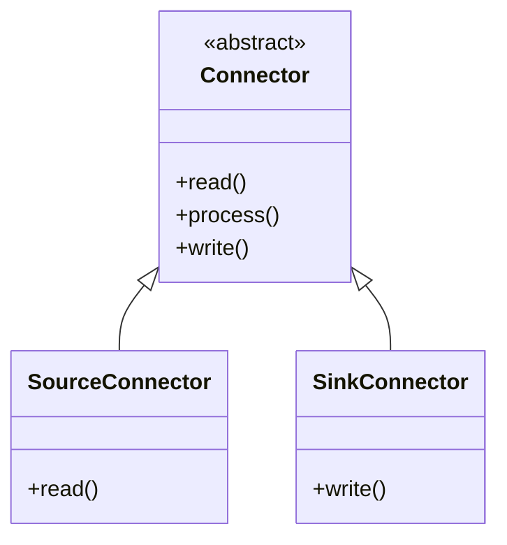
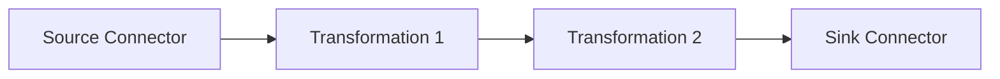
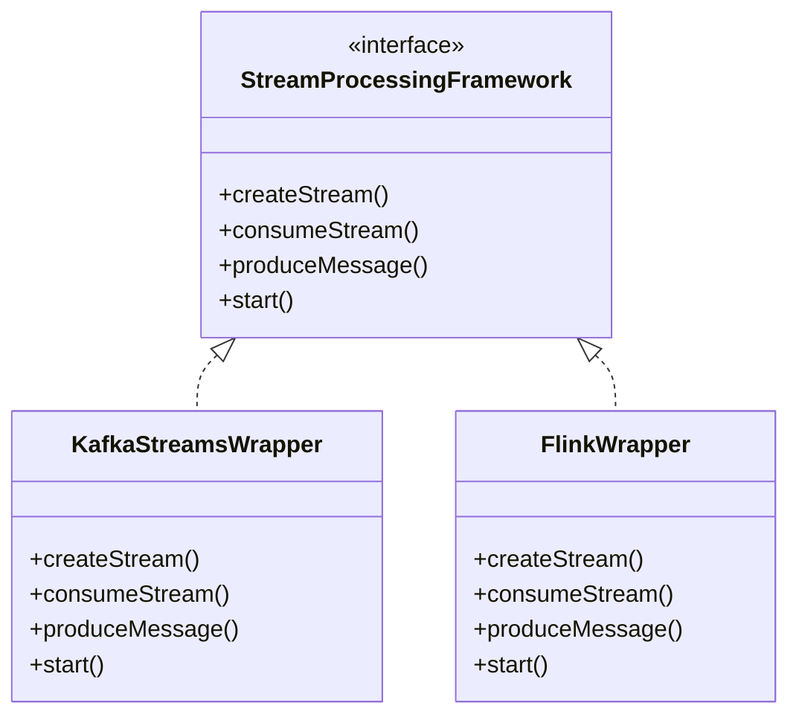
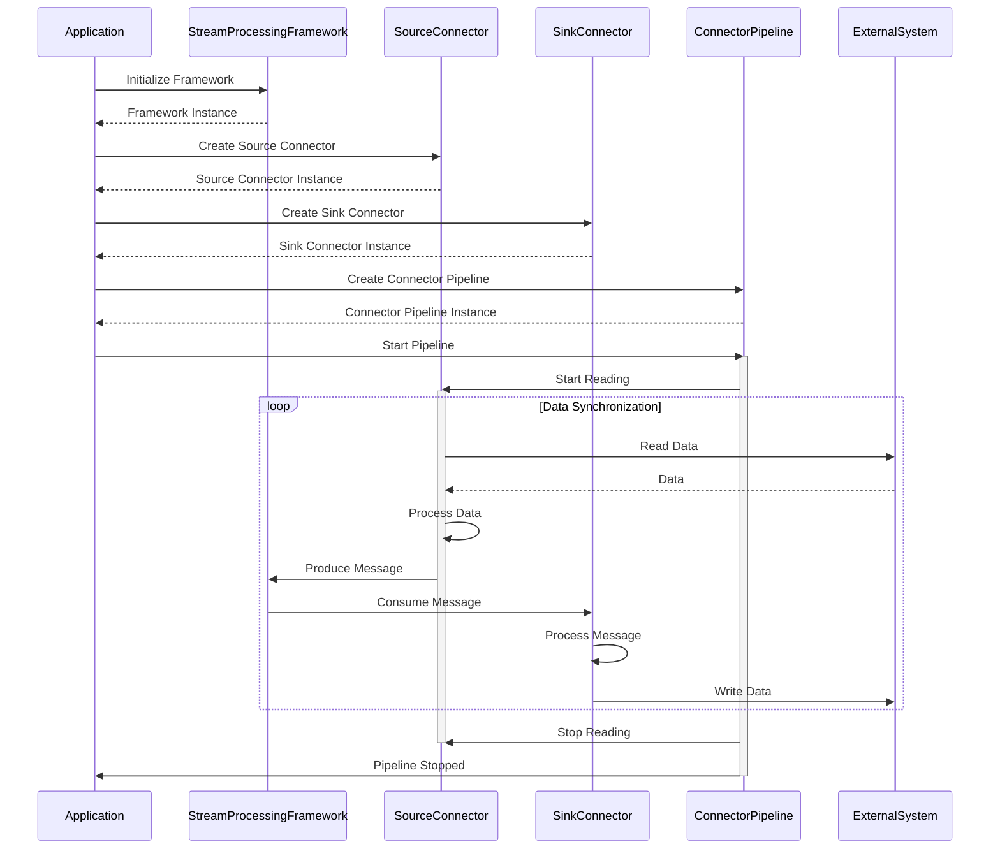
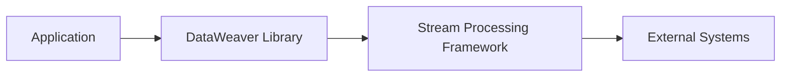

# Architecture Design Document (ADD) for DataWeaver

## 1. Introduction
This document provides a high-level overview of the system architecture for DataWeaver, a powerful and flexible library for building data synchronization pipelines. It describes the architectural patterns, key components, their interactions, and the deployment view of the system.

## 2. System Overview
DataWeaver is designed to simplify the process of building data synchronization pipelines between various systems using any stream processing library. It provides a set of abstractions and utilities that enable developers to easily create and manage connectors for different data sources and sinks, making it effortless to integrate with external systems.

The system architecture of DataWeaver follows a modular and extensible design, allowing developers to create custom connectors and pipelines while leveraging the capabilities of the underlying stream processing framework.

## 3. Architectural Patterns
DataWeaver employs the following architectural patterns:

### 3.1 Connector Pattern
The Connector Pattern is a design pattern that enables the integration of different data sources and sinks with the data synchronization pipeline. It provides a standardized interface for connecting to and interacting with external systems, allowing developers to create custom connectors by implementing the required methods.

### 3.2 Pipeline Pattern
The Pipeline Pattern is a design pattern that represents a series of steps or stages through which data flows and is processed. In DataWeaver, the pipeline consists of a source connector, optional transformations, and a sink connector. The data flows through the pipeline, undergoing transformations and modifications before being written to the sink.

### 3.3 Wrapper Pattern
The Wrapper Pattern is a design pattern that provides a simplified interface to a complex system. DataWeaver utilizes the Wrapper Pattern to abstract the complexities of integrating with different stream processing frameworks. It provides a common interface for interacting with the stream processing framework, allowing developers to focus on building the data synchronization pipeline without worrying about the underlying implementation details.

## 4. Key Components
DataWeaver consists of the following key components:

### 4.1 Connector
The Connector is an abstract base class that defines the interface for all connectors in the framework. It specifies the methods that connectors must implement, such as `read()`, `process()`, and `write()`. Developers create custom connectors by extending this base class and providing the necessary implementation for these methods.

### 4.2 Source Connector
The Source Connector is responsible for reading data from external systems and producing messages into the data pipeline. It extends the Connector base class and implements the `read()` method to retrieve data from the source system.

### 4.3 Sink Connector
The Sink Connector is responsible for consuming messages from the data pipeline and writing data to external systems. It extends the Connector base class and implements the `write()` method to store data in the sink system.

### 4.4 Connector Pipeline
The Connector Pipeline represents a data synchronization pipeline that connects a source connector to a sink connector. It orchestrates the flow of data from the source to the sink, handling message processing, transformation, and error handling.

### 4.5 Data Serialization
DataWeaver provides utilities for data serialization and deserialization, supporting various data formats such as JSON, Avro, and Protobuf. It abstracts away the details of data serialization and deserialization, providing a consistent interface for working with data regardless of the underlying format.

### 4.6 Error Handling
DataWeaver includes error handling and retry mechanisms to ensure data integrity and resilience. It provides configurable error handling strategies and retry policies to handle failures and transient issues during data synchronization.

## 5. Component Interactions
The following diagram illustrates the interactions between the key components of DataWeaver:

1. The application initializes the StreamProcessingFramework and creates instances of the SourceConnector, SinkConnector, and ConnectorPipeline.
2. The application starts the ConnectorPipeline.
3. The ConnectorPipeline instructs the SourceConnector to start reading data.
4. The SourceConnector reads data from the external system, processes it, and produces messages to the StreamProcessingFramework.
5. The StreamProcessingFramework consumes the messages and passes them to the SinkConnector.
6. The SinkConnector processes the messages and writes the data to the external system.
7. The data synchronization process continues until the application stops the ConnectorPipeline.
8. The ConnectorPipeline instructs the SourceConnector to stop reading data.
9. The ConnectorPipeline notifies the application that it has stopped.

## 6. Deployment View
DataWeaver is designed to be deployed as a library within an application that utilizes a stream processing framework. The application is responsible for initializing the StreamProcessingFramework, creating instances of the connectors and pipeline, and starting the data synchronization process.

The application integrates the DataWeaver library, which in turn interacts with the stream processing framework. The stream processing framework handles the underlying data processing and communication with external systems.

DataWeaver can be deployed in various environments, such as on-premises servers, cloud platforms, or containerized environments, depending on the requirements and infrastructure of the application.

## 7. Conclusion
The architecture of DataWeaver is designed to be modular, extensible, and scalable, enabling developers to build robust data synchronization pipelines with ease. By leveraging architectural patterns such as the Connector Pattern, Pipeline Pattern, and Wrapper Pattern, DataWeaver provides a flexible and intuitive framework for integrating with different data sources and sinks.

The key components of DataWeaver, including the Connector, Source Connector, Sink Connector, and Connector Pipeline, work together to enable seamless data synchronization and transformation. The interactions between these components ensure a smooth flow of data from the source to the sink, while handling error scenarios and ensuring data integrity.

DataWeaver's deployment view emphasizes its integration with the application and the underlying stream processing framework, allowing it to be deployed in various environments based on the specific needs of the application.

By following this architecture design, DataWeaver aims to simplify the process of building data synchronization pipelines, promote code reusability, and provide a scalable and fault-tolerant solution for data integration.