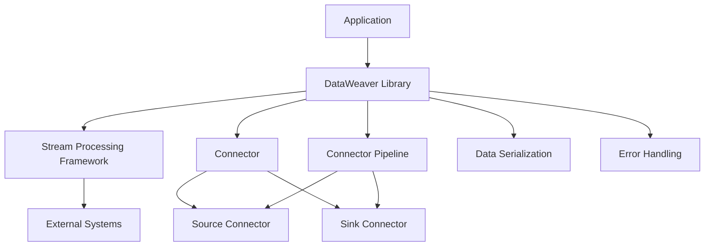
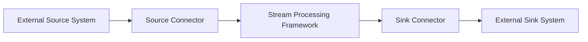

# High-Level Design (HLD) for DataWeaver

## 1. Introduction
This High-Level Design (HLD) document provides a detailed overview of the system architecture for DataWeaver, a flexible and powerful library for building data synchronization pipelines. It breaks down the major components of the system, presents architecture and data flow diagrams, and describes the interfaces between the components.

## 2. System Architecture
The system architecture of DataWeaver follows a modular and extensible design, enabling developers to create custom connectors and pipelines while leveraging the capabilities of the underlying stream processing framework. The architecture is composed of the following major components:

### 2.1 DataWeaver Library
The DataWeaver Library is the core component of the system. It provides a set of abstractions and utilities for building data synchronization pipelines. The library interacts with the stream processing framework and exposes a simple and intuitive API for developers to create and manage connectors and pipelines.

### 2.2 Stream Processing Framework
DataWeaver integrates with a stream processing framework, such as Apache Kafka or Apache Flink, to handle the underlying data processing and communication with external systems. The stream processing framework provides the necessary infrastructure for data ingestion, processing, and delivery.

### 2.3 Connector
The Connector is an abstract base class that defines the interface for all connectors in the framework. It specifies the methods that connectors must implement, such as `read()`, `process()`, and `write()`. Developers create custom connectors by extending this base class and providing the necessary implementation for these methods.

### 2.4 Source Connector
The Source Connector is responsible for reading data from external systems and producing messages into the data pipeline. It extends the Connector base class and implements the `read()` method to retrieve data from the source system.

### 2.5 Sink Connector
The Sink Connector is responsible for consuming messages from the data pipeline and writing data to external systems. It extends the Connector base class and implements the `write()` method to store data in the sink system.

### 2.6 Connector Pipeline
The Connector Pipeline represents a data synchronization pipeline that connects a source connector to a sink connector. It orchestrates the flow of data from the source to the sink, handling message processing, transformation, and error handling.

### 2.7 Data Serialization
DataWeaver provides utilities for data serialization and deserialization, supporting various data formats such as JSON, Avro, and Protobuf. It abstracts away the details of data serialization and deserialization, providing a consistent interface for working with data regardless of the underlying format.

### 2.8 Error Handling
DataWeaver includes error handling and retry mechanisms to ensure data integrity and resilience. It provides configurable error handling strategies and retry policies to handle failures and transient issues during data synchronization.

## 3. Data Flow Diagram
The following data flow diagram illustrates the flow of data through the DataWeaver system:

1. Data is ingested from an external source system into the Source Connector.
2. The Source Connector reads the data and produces messages into the stream processing framework.
3. The stream processing framework processes the messages and routes them to the Sink Connector.
4. The Sink Connector consumes the messages and writes the data to an external sink system.

## 4. Component Descriptions

### 4.1 DataWeaver Library
The DataWeaver Library is the central component of the system. It provides the necessary abstractions, utilities, and APIs for building data synchronization pipelines. The library is responsible for integrating with the stream processing framework, managing connectors and pipelines, and handling data serialization and error handling.

Key responsibilities:
- Provide a simple and intuitive API for creating and managing connectors and pipelines.
- Abstract the complexities of interacting with the stream processing framework.
- Handle data serialization and deserialization using various data formats.
- Provide error handling and retry mechanisms to ensure data integrity and resilience.

### 4.2 Stream Processing Framework
The Stream Processing Framework is an external component that DataWeaver integrates with to handle the underlying data processing and communication with external systems. Examples of stream processing frameworks include Apache Kafka and Apache Flink.

Key responsibilities:
- Provide the infrastructure for data ingestion, processing, and delivery.
- Handle the distribution and partitioning of data across multiple nodes.
- Ensure fault tolerance and scalability of the data processing pipeline.

### 4.3 Connector
The Connector is an abstract base class that defines the interface for all connectors in the framework. It specifies the methods that connectors must implement, such as `read()`, `process()`, and `write()`.

Key responsibilities:
- Define the common interface for all connectors.
- Specify the methods that connectors must implement.
- Provide a foundation for creating custom connectors.

### 4.4 Source Connector
The Source Connector is responsible for reading data from external systems and producing messages into the data pipeline. It extends the Connector base class and implements the `read()` method to retrieve data from the source system.

Key responsibilities:
- Read data from external source systems.
- Convert the data into a suitable format for the data pipeline.
- Produce messages into the stream processing framework.

### 4.5 Sink Connector
The Sink Connector is responsible for consuming messages from the data pipeline and writing data to external systems. It extends the Connector base class and implements the `write()` method to store data in the sink system.

Key responsibilities:
- Consume messages from the stream processing framework.
- Process and transform the data if necessary.
- Write the data to external sink systems.

### 4.6 Connector Pipeline
The Connector Pipeline represents a data synchronization pipeline that connects a source connector to a sink connector. It orchestrates the flow of data from the source to the sink, handling message processing, transformation, and error handling.

Key responsibilities:
- Configure and manage the source and sink connectors.
- Orchestrate the flow of data from the source to the sink.
- Apply any necessary data transformations or processing.
- Handle errors and ensure data integrity.

### 4.7 Data Serialization
DataWeaver provides utilities for data serialization and deserialization, supporting various data formats such as JSON, Avro, and Protobuf. It abstracts away the details of data serialization and deserialization, providing a consistent interface for working with data regardless of the underlying format.

Key responsibilities:
- Serialize data into a specific format before sending it through the data pipeline.
- Deserialize data received from the data pipeline into a usable format.
- Support multiple data formats and provide a consistent interface for data serialization and deserialization.

### 4.8 Error Handling
DataWeaver includes error handling and retry mechanisms to ensure data integrity and resilience. It provides configurable error handling strategies and retry policies to handle failures and transient issues during data synchronization.

Key responsibilities:
- Detect and handle errors that occur during data synchronization.
- Implement retry mechanisms to handle transient failures.
- Provide configurable error handling strategies and retry policies.
- Ensure data integrity and resilience in the face of failures.

## 5. Interfaces

### 5.1 DataWeaver Library API
The DataWeaver Library exposes a simple and intuitive API for developers to create and manage connectors and pipelines. The API includes methods for configuring connectors, creating pipelines, starting and stopping data synchronization, and handling errors.

Key methods:
- `create_connector(config)`: Creates a new connector instance based on the provided configuration.
- `create_pipeline(source_connector, sink_connector)`: Creates a new pipeline instance connecting the specified source and sink connectors.
- `start_pipeline(pipeline)`: Starts the data synchronization process for the specified pipeline.
- `stop_pipeline(pipeline)`: Stops the data synchronization process for the specified pipeline.
- `handle_error(error)`: Handles errors that occur during data synchronization.

### 5.2 Connector Interface
The Connector interface defines the methods that all connectors must implement. It serves as a contract between the DataWeaver Library and the individual connectors.

Key methods:
- `read()`: Reads data from the external system (implemented by source connectors).
- `process(data)`: Processes and transforms the data (implemented by both source and sink connectors).
- `write(data)`: Writes data to the external system (implemented by sink connectors).

### 5.3 Stream Processing Framework Interface
DataWeaver integrates with the stream processing framework through its provided interface. The exact interface depends on the specific stream processing framework being used (e.g., Apache Kafka, Apache Flink).

Common methods:
- `create_stream(config)`: Creates a new stream based on the provided configuration.
- `publish(message)`: Publishes a message to the stream.
- `subscribe(topic, callback)`: Subscribes to a specific topic and registers a callback function to handle received messages.

## 6. Conclusion
The High-Level Design (HLD) document provides a detailed overview of the DataWeaver system architecture, breaking down the major components and their interactions. The modular and extensible architecture allows developers to create custom connectors and pipelines while leveraging the capabilities of the underlying stream processing framework.

The DataWeaver Library serves as the central component, providing abstractions, utilities, and APIs for building data synchronization pipelines. It integrates with the stream processing framework to handle data processing and communication with external systems.

Connectors play a crucial role in the system, with the Source Connector responsible for reading data from external systems and the Sink Connector responsible for writing data to external systems. The Connector Pipeline orchestrates the flow of data between the connectors, applying any necessary transformations and handling errors.

DataWeaver also includes utilities for data serialization and deserialization, supporting various data formats, and provides error handling and retry mechanisms to ensure data integrity and resilience.

The interfaces defined in the HLD document serve as contracts between the components, specifying the methods and interactions required for seamless integration and communication.

By following this high-level design, DataWeaver aims to provide a flexible and powerful framework for building data synchronization pipelines, enabling developers to easily integrate various data sources and sinks while ensuring scalability, fault tolerance, and ease of use.