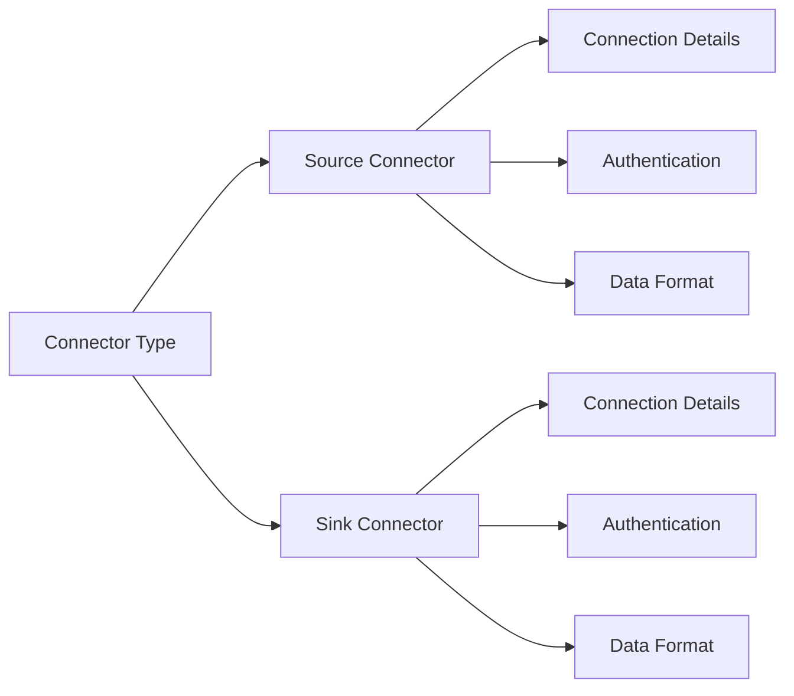
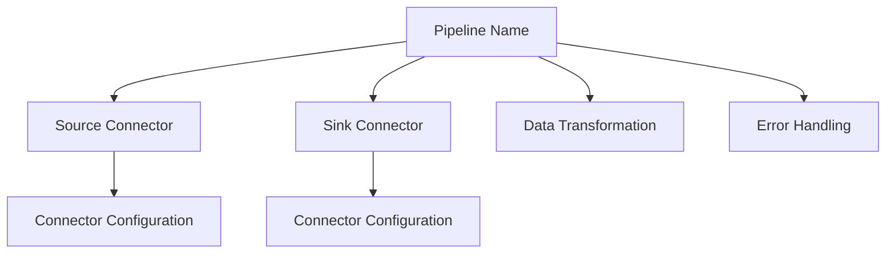
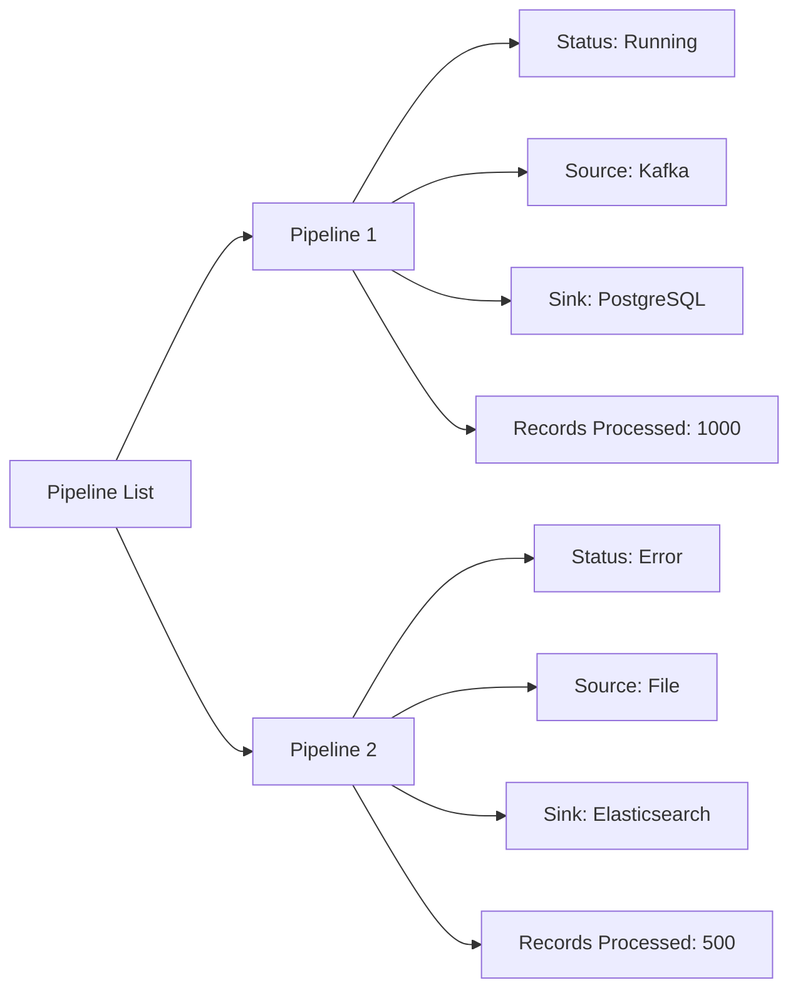
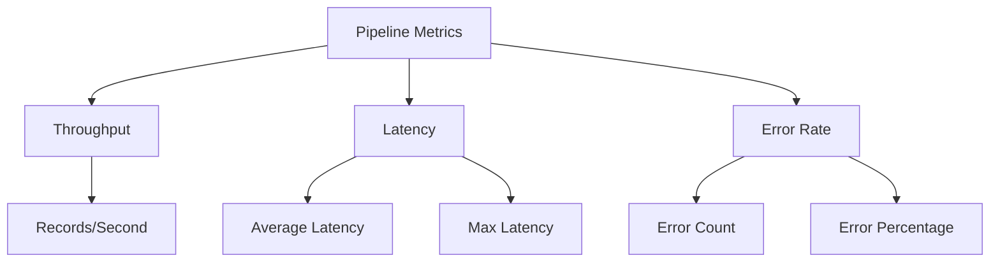
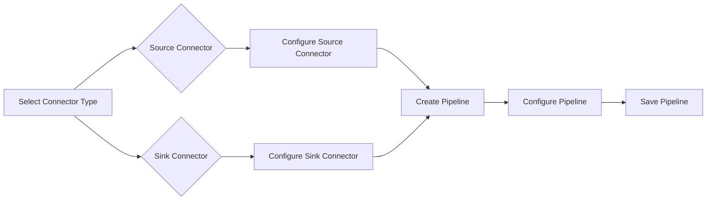
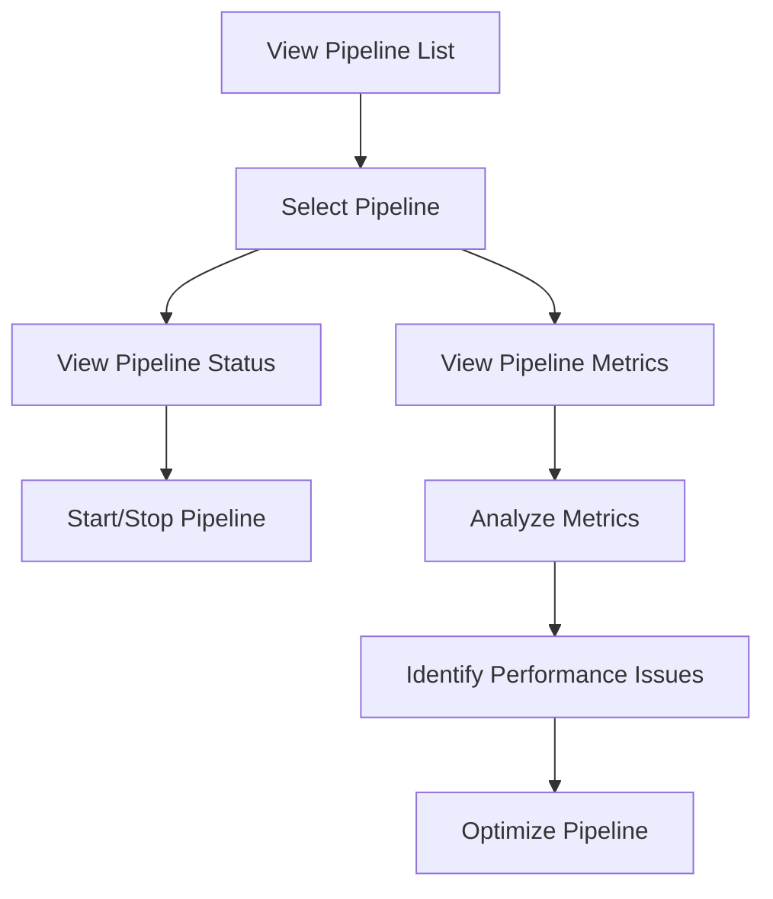

# Interface Design Document for DataWeaver

## 1. Introduction
This Interface Design Document outlines the design of user interfaces and external system interfaces for DataWeaver, a flexible and powerful library for building data synchronization pipelines. It includes mockups, wireframes, user interface flow, and API specifications to provide a clear understanding of how users and external systems will interact with DataWeaver.

## 2. User Interface Design

### 2.1 Configuration Interface

#### 2.1.1 Connector Configuration

#### 2.1.2 Pipeline Configuration

### 2.2 Monitoring Interface

#### 2.2.1 Pipeline Status Dashboard

#### 2.2.2 Pipeline Metrics

## 3. External System Interfaces

### 3.1 Connector APIs

#### 3.1.1 Source Connector API
- `read()`
    - Description: Reads data from the external source system.
    - Request: None
    - Response: Iterator of data records

#### 3.1.2 Sink Connector API
- `write(data)`
    - Description: Writes data to the external sink system.
    - Request:
        - `data`: The data record to be written.
    - Response: None

### 3.2 Stream Processing Framework API

#### 3.2.1 Create Stream
- `create_stream(config)`
    - Description: Creates a new stream in the stream processing framework.
    - Request:
        - `config`: The configuration settings for the stream.
    - Response: Stream identifier

#### 3.2.2 Publish Message
- `publish(message)`
    - Description: Publishes a message to the stream.
    - Request:
        - `message`: The message to be published.
    - Response: None

#### 3.2.3 Subscribe to Topic
- `subscribe(topic, callback)`
    - Description: Subscribes to a specific topic and registers a callback function to handle received messages.
    - Request:
        - `topic`: The topic to subscribe to.
        - `callback`: The callback function to handle received messages.
    - Response: None

### 3.3 Data Serialization and Deserialization APIs

#### 3.3.1 Serializer API
- `serialize(data)`
    - Description: Serializes the data into a specific format.
    - Request:
        - `data`: The data to be serialized.
    - Response: Serialized data (bytes)

#### 3.3.2 Deserializer API
- `deserialize(data)`
    - Description: Deserializes the data from a specific format.
    - Request:
        - `data`: The serialized data (bytes) to be deserialized.
    - Response: Deserialized data

## 4. User Interface Flow

### 4.1 Configuration Flow

### 4.2 Monitoring Flow

## 5. Conclusion
The Interface Design Document provides a comprehensive overview of the user interfaces and external system interfaces for DataWeaver. It includes mockups and wireframes for the configuration and monitoring interfaces, allowing users to easily set up and manage data synchronization pipelines.

The document also specifies the APIs for interacting with connectors, the stream processing framework, and data serialization and deserialization. These APIs define the contracts and communication protocols between DataWeaver and external systems.

The user interface flow diagrams illustrate the step-by-step processes for configuring pipelines and monitoring their status and metrics. This helps users understand the navigation and interaction flow within the DataWeaver system.

By providing clear and detailed interface designs, this document serves as a blueprint for the development team to implement the user interfaces and integrate with external systems effectively. It ensures a consistent and intuitive user experience while enabling seamless communication between DataWeaver and other components of the data synchronization ecosystem.