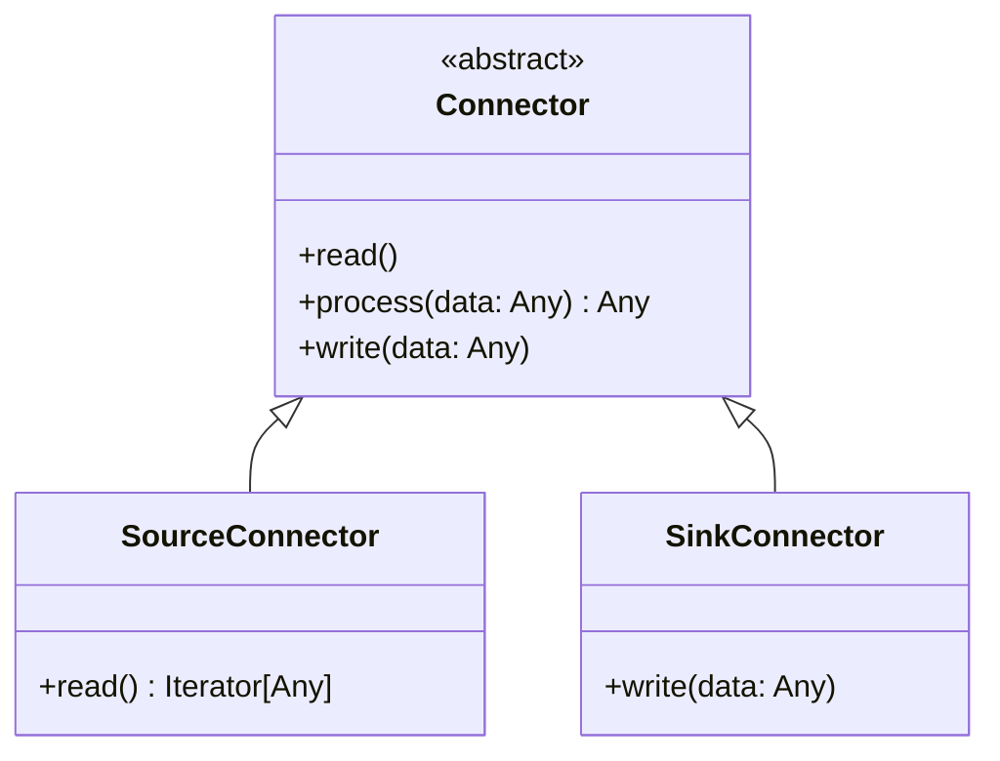
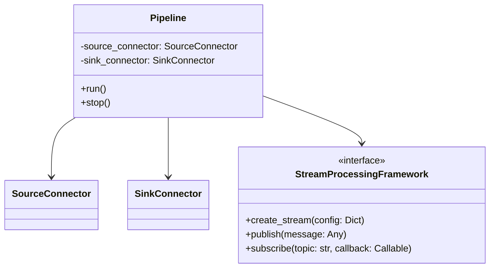
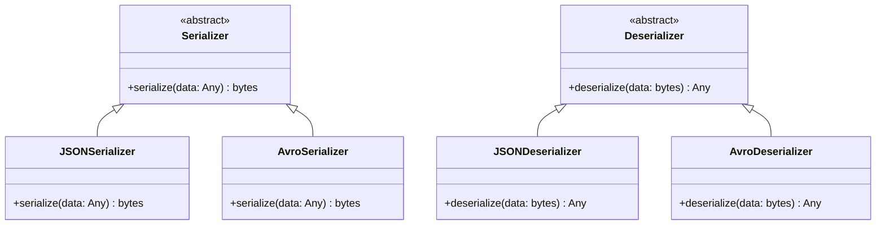
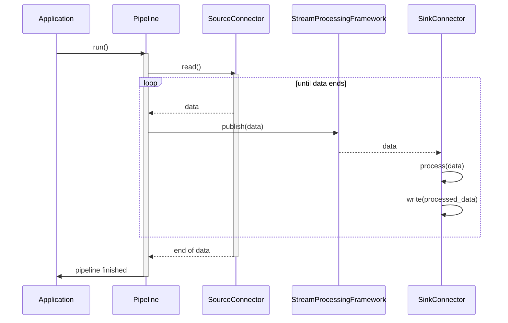
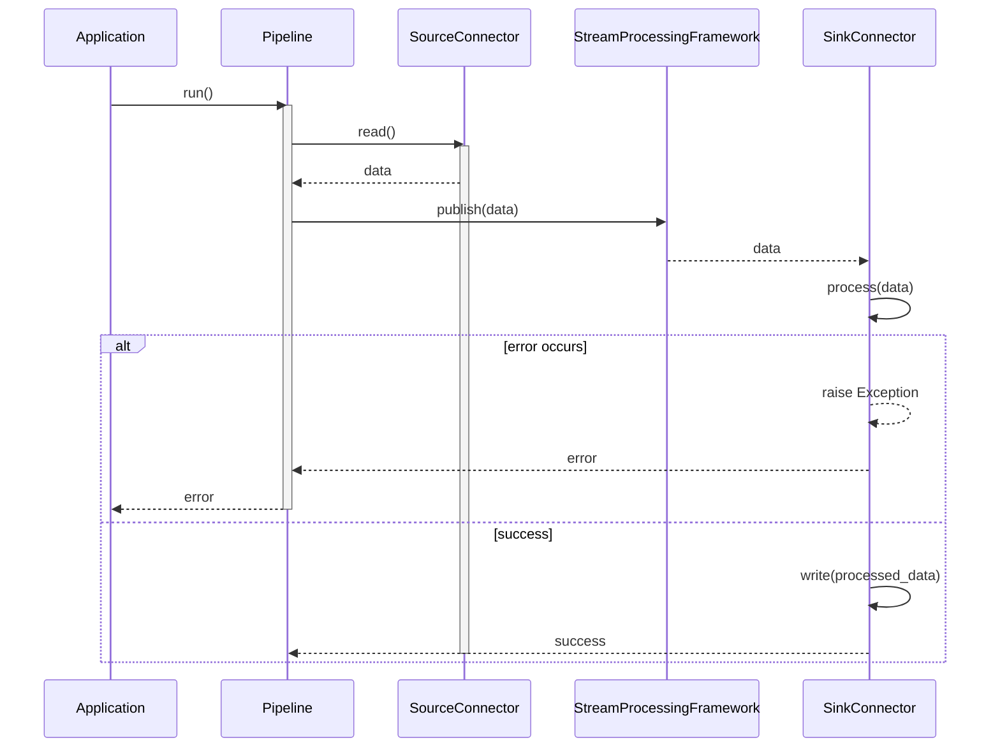
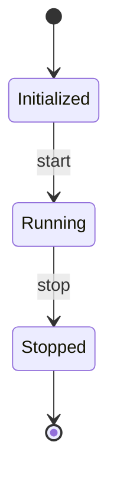
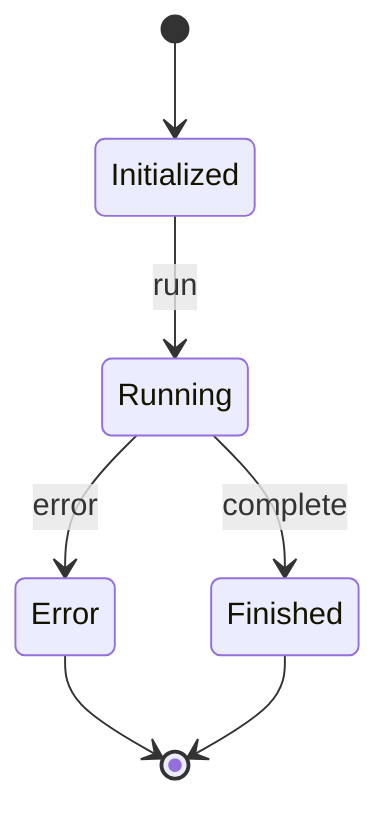

# Low-Level Design (LLD) for DataWeaver

## 1. Introduction
This Low-Level Design (LLD) document provides a detailed design of the individual components in the DataWeaver system. It includes class diagrams, sequence diagrams, state diagrams, and detailed descriptions of algorithms and data structures used in the implementation of DataWeaver.

## 2. Class Diagrams

### 2.1 Connector Classes

### 2.2 Pipeline Classes

### 2.3 Data Serialization Classes

## 3. Sequence Diagrams

### 3.1 Data Synchronization Flow

### 3.2 Error Handling Flow

## 4. State Diagrams

### 4.1 Connector States

### 4.2 Pipeline States

## 5. Detailed Descriptions

### 5.1 Data Synchronization Algorithm
1. The application creates an instance of the `Pipeline` class, specifying the source and sink connectors.
2. The application calls the `run()` method on the pipeline instance to start the data synchronization process.
3. The pipeline calls the `read()` method on the source connector to retrieve data from the external source system.
4. The source connector reads the data and yields it back to the pipeline.
5. For each data item received from the source connector, the pipeline performs the following steps:
    - Calls the `process(data)` method on the source connector to apply any necessary transformations or processing.
    - Publishes the processed data to the stream processing framework using the `publish(data)` method.
    - The stream processing framework delivers the data to the sink connector.
    - The sink connector receives the data and calls the `process(data)` method to apply any necessary transformations or processing.
    - The sink connector calls the `write(processed_data)` method to write the processed data to the external sink system.
6. The data synchronization process continues until the source connector indicates the end of data.
7. Once the data synchronization is complete, the pipeline notifies the application.

### 5.2 Error Handling Algorithm
1. During the data synchronization process, if an error occurs in the sink connector while processing or writing data, the sink connector raises an exception.
2. The exception is caught by the pipeline, which then notifies the application about the error.
3. The application can choose to handle the error based on its specific requirements, such as retrying the operation, logging the error, or terminating the pipeline.
4. If the error is not recoverable, the pipeline transitions to the error state and stops the data synchronization process.

### 5.3 Data Serialization and Deserialization
1. DataWeaver supports various data formats for serialization and deserialization, such as JSON and Avro.
2. The `Serializer` and `Deserializer` classes provide an abstract interface for serialization and deserialization operations.
3. Concrete implementations of serializers and deserializers, such as `JSONSerializer`, `JSONDeserializer`, `AvroSerializer`, and `AvroDeserializer`, handle the specific serialization and deserialization logic for each supported data format.
4. When publishing data to the stream processing framework, the pipeline uses the appropriate serializer to convert the data into a serialized format (e.g., bytes).
5. When receiving data from the stream processing framework, the pipeline uses the appropriate deserializer to convert the serialized data back into its original format.

## 6. Data Structures

### 6.1 Connector Configuration
- `connector_config`: A dictionary that stores the configuration settings for a connector, such as connection details, authentication credentials, and other connector-specific options.

### 6.2 Pipeline Configuration
- `pipeline_config`: A dictionary that stores the configuration settings for a pipeline, such as the source and sink connectors, data transformation settings, and error handling options.

### 6.3 Data Records
- `data_record`: A dictionary or object that represents a single unit of data being processed by the pipeline. It can contain multiple fields or attributes, depending on the specific data format and schema.

## 7. Conclusion
The Low-Level Design (LLD) document provides a detailed design of the individual components in the DataWeaver system. It includes class diagrams showcasing the structure and relationships of the connector, pipeline, and data serialization classes. Sequence diagrams illustrate the flow of data synchronization and error handling processes.

The state diagrams depict the different states and transitions of connectors and pipelines during their lifecycle. Detailed descriptions of the data synchronization and error handling algorithms explain the step-by-step processes involved.

The document also covers the data serialization and deserialization mechanisms supported by DataWeaver, allowing for flexibility in handling different data formats. Key data structures, such as connector and pipeline configurations and data records, are highlighted.

By providing this level of detail in the LLD document, developers have a clear understanding of how to implement the various components of DataWeaver, ensuring a consistent and efficient development process. The LLD serves as a valuable reference for the development team, guiding them in writing clean, modular, and maintainable code.