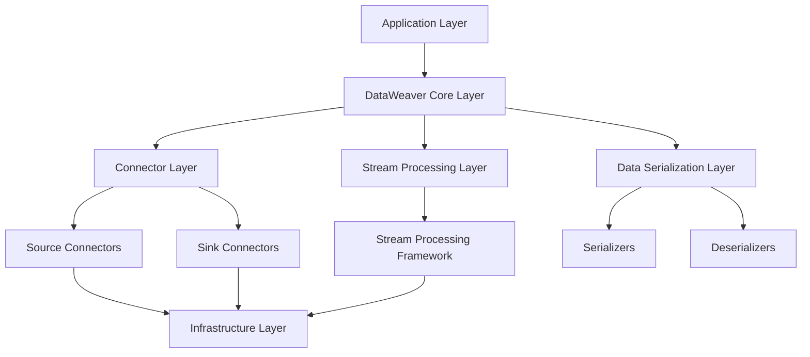

# System Architecture Document for DataWeaver

## 1. Introduction
This System Architecture Document describes the overall architecture and technology stack of DataWeaver, a flexible and powerful library for building data synchronization pipelines. It provides an overview of the architecture layers, components, modules, and their interactions within the DataWeaver system.

## 2. Architecture Overview
DataWeaver follows a layered architecture approach, separating concerns and responsibilities into distinct layers. The architecture consists of the following main layers:

1. Application Layer
2. DataWeaver Core Layer
3. Connector Layer
4. Stream Processing Layer
5. Data Serialization Layer
6. Infrastructure Layer

The following diagram illustrates the high-level architecture of DataWeaver:

## 3. Architecture Layers

### 3.1 Application Layer
The Application Layer represents the user-facing applications or systems that integrate with DataWeaver to build data synchronization pipelines. This layer interacts with the DataWeaver Core Layer to configure and manage pipelines, connectors, and other components.

### 3.2 DataWeaver Core Layer
The DataWeaver Core Layer is the central component of the DataWeaver system. It provides the core functionality and abstractions for building and managing data synchronization pipelines. This layer includes the following key modules:

- Pipeline Manager: Responsible for creating, configuring, and managing pipelines.
- Connector Manager: Handles the registration, configuration, and management of connectors.
- Data Transformation Engine: Provides the ability to apply data transformations and manipulations within the pipeline.
- Error Handling Framework: Implements error handling and recovery mechanisms to ensure data integrity and resilience.

### 3.3 Connector Layer
The Connector Layer contains the various connectors that enable integration with external systems and data sources/sinks. This layer includes two main types of connectors:

- Source Connectors: Responsible for reading data from external source systems and feeding it into the pipeline.
- Sink Connectors: Responsible for writing data from the pipeline to external sink systems.

Connectors communicate with the DataWeaver Core Layer to receive configuration and send/receive data.

### 3.4 Stream Processing Layer
The Stream Processing Layer integrates with a stream processing framework to handle the data flow and processing within the pipeline. This layer leverages the capabilities of the stream processing framework to ensure scalability, fault tolerance, and efficient data processing.

The Stream Processing Framework module within this layer provides an abstraction layer over the specific stream processing framework being used, allowing DataWeaver to work with different frameworks interchangeably.

### 3.5 Data Serialization Layer
The Data Serialization Layer handles the serialization and deserialization of data as it flows through the pipeline. This layer includes the following modules:

- Serializers: Convert data from its native format to a serialized format suitable for transmission or storage.
- Deserializers: Convert serialized data back to its native format for processing or consumption.

The Data Serialization Layer supports various data formats, such as JSON, Avro, and Protobuf, and provides a pluggable architecture to accommodate custom serialization formats.

### 3.6 Infrastructure Layer
The Infrastructure Layer represents the underlying infrastructure and resources required to deploy and run DataWeaver pipelines. This layer includes components such as:

- Compute Resources: Physical or virtual machines, containers, or serverless functions that execute the pipeline components.
- Storage Resources: Databases, file systems, or object storage used for storing data and state.
- Network Resources: Networking infrastructure and protocols for communication between components.

The Infrastructure Layer is typically managed by the deployment environment or platform, such as Kubernetes, cloud providers, or on-premises data centers.

## 4. Technology Stack
DataWeaver leverages the following technologies and frameworks in its implementation:

- Programming Language: Python
- Stream Processing Frameworks:
    - Apache Kafka
    - Apache Flink
    - Apache Spark Streaming
- Data Serialization Formats:
    - JSON
    - Apache Avro
    - Protocol Buffers (Protobuf)
- Infrastructure and Deployment:
    - Kubernetes
    - Docker
    - Cloud Platforms (AWS, GCP, Azure)
- Monitoring and Logging:
    - Prometheus
    - Grafana
    - ELK Stack (Elasticsearch, Logstash, Kibana)

The technology stack can be extended or modified based on the specific requirements and preferences of the organization or project.

## 5. Component Interaction
The components within the DataWeaver architecture interact with each other to enable seamless data synchronization and processing. Here's an overview of the key interactions:

1. The Application Layer interacts with the DataWeaver Core Layer to configure and manage pipelines, connectors, and other components.
2. The DataWeaver Core Layer communicates with the Connector Layer to register, configure, and manage connectors.
3. Source Connectors in the Connector Layer read data from external source systems and feed it into the pipeline through the DataWeaver Core Layer.
4. The DataWeaver Core Layer passes the data to the Stream Processing Layer for processing and transformation.
5. The Stream Processing Layer leverages the Stream Processing Framework to handle data flow, processing, and routing within the pipeline.
6. The Data Serialization Layer is used by the Stream Processing Layer and Connector Layer to serialize and deserialize data as it moves through the pipeline.
7. Sink Connectors in the Connector Layer receive processed data from the DataWeaver Core Layer and write it to external sink systems.
8. The Infrastructure Layer provides the necessary compute, storage, and network resources to deploy and run the DataWeaver pipeline components.

## 6. Scalability and Performance Considerations
DataWeaver is designed to handle high volumes of data and scale horizontally to meet performance requirements. The following considerations are taken into account to ensure scalability and optimal performance:

- The Stream Processing Layer leverages the scalability features of the chosen stream processing framework to distribute the workload across multiple nodes or instances.
- Connectors are designed to be stateless and can be scaled independently based on the throughput requirements of the source and sink systems.
- The DataWeaver Core Layer can be scaled horizontally to handle increased pipeline management and coordination tasks.
- The Data Serialization Layer is optimized for efficient serialization and deserialization of data, minimizing overhead and latency.
- The Infrastructure Layer is designed to be elastic and can scale resources up or down based on the workload demands.

## 7. Extensibility and Customization
DataWeaver provides extension points and customization options to accommodate specific requirements and integrate with additional systems and frameworks. The following areas can be extended or customized:

- Connectors: Custom connectors can be developed to integrate with specific source or sink systems not covered by the built-in connectors.
- Data Transformations: Custom data transformation logic can be implemented within the pipeline to meet specific business requirements.
- Serialization Formats: Additional serialization formats can be supported by implementing custom serializers and deserializers.
- Error Handling: Custom error handling and recovery strategies can be implemented to handle specific error scenarios or integrate with external monitoring and alerting systems.
- Stream Processing Frameworks: DataWeaver can be extended to support additional stream processing frameworks beyond the ones currently supported.

## 8. Conclusion
The System Architecture Document provides a comprehensive overview of the architecture and technology stack of DataWeaver. By following a layered architecture approach and leveraging proven technologies and frameworks, DataWeaver offers a flexible and scalable solution for building data synchronization pipelines.

The document outlines the key architecture layers, including the Application Layer, DataWeaver Core Layer, Connector Layer, Stream Processing Layer, Data Serialization Layer, and Infrastructure Layer. It also highlights the interactions between these layers and components to enable seamless data flow and processing.

The technology stack section provides insights into the specific technologies and frameworks used in the implementation of DataWeaver, allowing developers and stakeholders to understand the technical foundations of the system.

Scalability and performance considerations are addressed to ensure that DataWeaver can handle high volumes of data and scale horizontally to meet performance requirements. The document also emphasizes the extensibility and customization options available to accommodate specific requirements and integrate with additional systems and frameworks.

Overall, this System Architecture Document serves as a valuable resource for developers, architects, and stakeholders involved in the development, deployment, and maintenance of DataWeaver. It provides a clear understanding of the system's architecture, components, and interactions, enabling effective collaboration and decision-making throughout the project lifecycle.